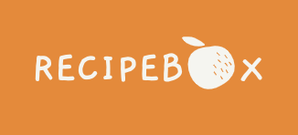
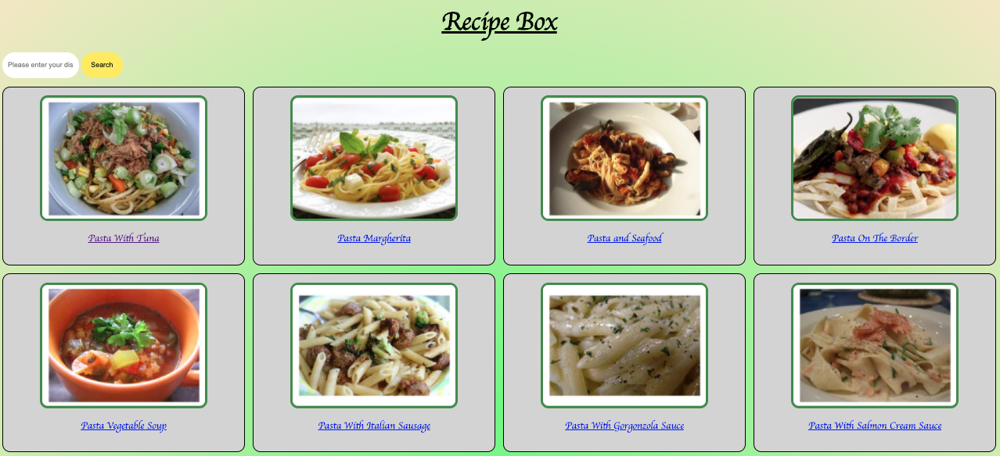
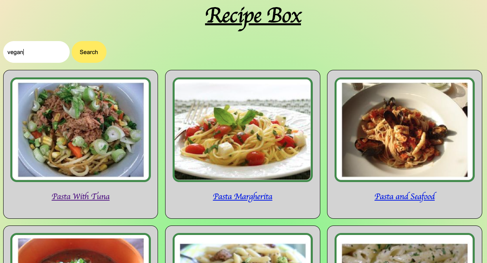
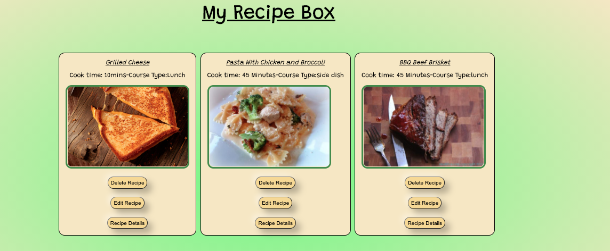
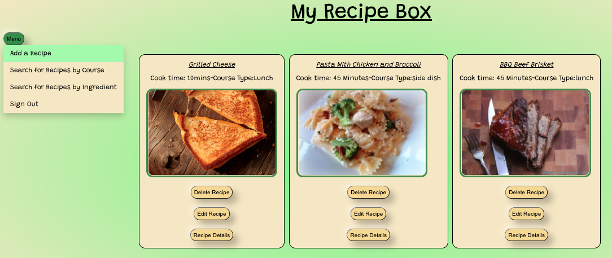
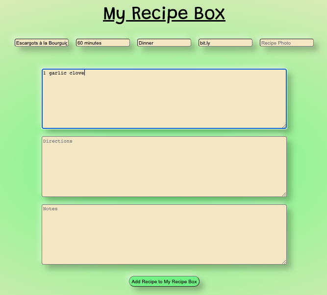
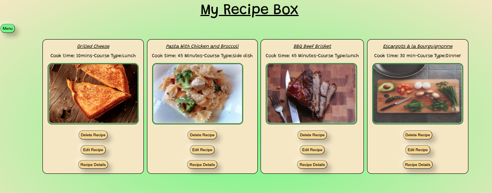

 
 <body style="background-color:">
 ## FSI 09/20 BE PROJECT:

___
# Recipe Box Application
**Version 1.0.0**

### 
___
RecipeBox started as an concept from the mind of one of the major contributors to the project, Shannel Philp, a wife and mother of 3 children.

With varying dietary needs and preferences for each member of the family, meal management can become a very cumbersome and taxing experience. This is where RecipeBox comes in. 

<!-- TABLE OF CONTENTS -->
## Table of Contents

* [Project Description](#about-the-project)
  * [Built With](#built-with)
* [Getting Started](#getting-started)
  * [Prerequisites & Installation](#prerequisites)

* [Usage](#usage)


* [Contributors](#contact)
* [Acknowledgements](#acknowledgements)


<!-- ABOUT THE PROJECT -->
## <span style="color:"> Project Description </span>

<!--[![Product Name Screen Shot][product-screenshot]](https://example.com)-->

<!-- 
RecipeBox started as an concept from the mind of one of the major contributors to the project, Shannel Philp, a wife and mother of 8 children.

With varying dietary needs and preferences for each member of the family, meal management can become a very cumbersome and taxing experience. This is where RecipeBox comes in. 
-->

I put this together to show what a detailed README is like. This README is written and styled in Markdown.  You can edit this eitehr in the browser or your code editor. VScode does have a Markdown extension which will show you the syntax highlighting.



Recipe Box is your Modern day Recipe Book, it can help even the most seasoned Cooks to very easily store and manage their Recipes on the fly.<br/>
While also enabling the culinary curious user to browse thousand of new recipes, via search by Dish/ingredient, or Course.
___


### Built With
* [JavaScript](https://javascript.com)
* [NodeJS/Express](expressjs.com)
* [Mustache Express]()
____
<!-- 
* []() not the above example of how to link in Markdown.
-->
<br/>
<!-- USAGE EXAMPLES -->

# Getting Started:

## Prerequisites & Installation 

The main component needed to run RecipeBox is Node.js 

 <!-- * Installing Node:-->
* If you dont have Node installed already, you can Download Node.js <a href="https://nodejs.org/en/">Here</a>

    or 

  Install Node using your Terminal or any Text-Base Interface with the command:


```sh
            npm install npm -g 
```
* Confirm you have successfully installed Node by checking the version no. using:

```sh
            node -v 
```

* You can download RecipeBox project file to your computer directly by hovering over the "Code" dropdown in Github and clicking the "Download Zip" option. <br/> You can also use the terminal to clone  the project to the desired location on you computer by running :

```sh
            git clone https://github.com/hptran7/Recipes-Project.git
```

### <span style="color:red"> </span> 

* Next install all the project dependancies by running the following command while inside the Recipes-Project file:
```sh
            npm install
```

* Finally, using the terminal, call the following command from inside of the Recipes-Project file to launch RecipeBox:
```sh
            node app.js 
```

<!-- USAGE EXAMPLES -->
## <span style="color:white"> Usage  </span>

----
<br/>
<br/>
<!-- GETTING STARTED -->

RecipeBox is a simple way to help store, manage and share all of your favorite dishes.<br>


<!-- Blah --->


____
<label style="margin-bottom:10%">RecipeBox allows you (login as a guest and gain) access to a vast collection of Dishes from all over the globe, seamlessly.<br/></label>
 
1. <label style="margin-top:100%" > Simply click the Guest Login button to bypass signup  
2. Select the "Search for Recipes by Ingredients" option from the dropdown menu 

 

___________
3. Input whatever eats you fancy using the search bar on the Home Page (eg. Vegan)
</label>
 
 
 

 
 
 
 
 
 ___
  RecipeBox will supply a slew of different options: ranging from the more traditional and mundane dishes to those with a bit of added flair. Whatever you crave you will find in RecipeBox.


___
Creating a Free Account will generate your own personal Recipe Box enabling you to create & keep track of all your favorite personal recipes, as well as the many thousands of new recipes you will discover on RecipeBox.




_____
Adding a new Custom Recipe to your personal RecipeBox is as simple as:<br/>
 * Selecting the "Add a Recipe" option from the Left Menu.




___
 * Entering your Recipe Details like: Dish Name, Cook Time, Ingredients and the like, into the approptiate field(s) <br/>

 * and Clicking the "Add Recipe to my Recipe Box" button at the bottom of the page.





<label>Voilà ! You're new creation is saved to, and readily accessible in, your personal RecipeBox!
 </label>




___


<!-- You should explain how to get your project up and running locally. EXAMPLE: To get a local copy up and running follow these simple steps. -->


_**If you made it this far:**<br/><br/>
`Thank You for viewing our readme!`_

Contributer Details are listed below.

<!-- ## Videos and Screenshots -->
<!--
Display videos, gifs are the easiest. Also include screenshots of the project, diffrent features or what not.
 


<!-- ROADMAP 
## <span style="color:yellow">  Roadmap </span> 
-->


___


<!-- CONTACT -->
## <span style="color:yellow"> Contributors </span>

- Shannel P. -------https://github.com/S-Philp

- Hung T. ----------https://github.com/hptran7
- Adebowale O. -----https://github.com/AOLink
<br/><br/>

Project Link: [https://github.com/hptran7/Recipes-Project](https://github.com/hptran7/Recipes-Project)


___
<!-- ACKNOWLEDGEMENTS -->
##  <span style="color:yellow"> Acknowledgements

*  Azam Sharp- Digital Crafts Instructor
 
  - **Nathan Orris** - **The Certified** [!- **DiR at DigitalCrafts Houston** -
    [NathanNoSudo](https://github.com/NathanNoSudo)
 - **Othneildrew**  -
    [OthneilDrew](https://github.com/othneildrew)


<!--
Docs must be:
-Accurate 
-complete
-concise
-Well organized

Key Use Cases
Key Concepts you need to understand to use the module

"Getting Started with Recipe-App" =====> Tasks

Examples are critical!

more examples the better.

1.Describe what Recipe-App does.
2.Describe How to use it.


 -->

 Digital Crafts Full Stack Immersive 09/2020 Back-End Project.

 </body>
