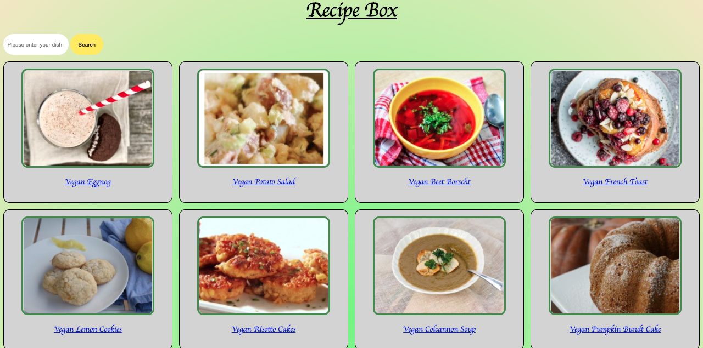

 
 <body style="background-color:">
 ## FSI 09/20 BE PROJECT:
___

# Recipe Box Application
**Version 1.0.0**

### 
___
This repo serves as a guide to "Recipe Box" and gives a detailed walkthrough of the Applicaton.

<!-- TABLE OF CONTENTS -->
## Table of Contents

* [About the Project](#about-the-project)
  * [Built With](#built-with)
* [Getting Started](#getting-started)
  * [Prerequisites](#prerequisites)
  * [Installation](#installation)
* [Usage](#usage)
* [Videos And Screenshots](#videos-and-screenshots)
* [Roadmap](#roadmap)
* [Contributing](#contributing)
* [License](#license)
* [Contact](#contact)
* [Acknowledgements](#acknowledgements)


<!-- ABOUT THE PROJECT -->
## <span style="color:red"> Project Description* </span>

<!--[![Product Name Screen Shot][product-screenshot]](https://example.com)-->


I put this together to show what a detailed README is like. This README is written and styled in Markdown.  You can edit this eitehr in the browser or your code editor. VScode does have a Markdown extension which will show you the syntax highlighting.


Why doing this detailed README is important:
* Recruiters who looks at your project might not know how to reade code.
* You an reuse it over and over again. Save time and work on your projects more by just editing this to match your next project!
* You should element DRY principles to the rest of your life :smile:


Here's a blank template to get started:
**To avoid retyping too much info. Do a search and replace with your text editor for the following:**
`github_username`, `repo_name`, `twitter_handle`, `email`


### Built With
* [JavaScript](https://javascript.com)
* [NodeJS/Express](expressjs.com)
* [Mustache Express]()
<!-- 
* []() not the above example of how to link in Markdown.
-->


<!-- GETTING STARTED -->
## <span style="color:green"> Getting Started 
RecipeBox is a simple way to help store, manage and share all of your favorite dishes.<br>


<!-- Blah --->


____
<label style="margin-bottom:10%">RecipeBox allows you (login as a guest and gain) access to a vast collection of Dishes from all over the globe, seamlessly.<br/></label>
 
<label style="margin-top:100%" > Simply input whatever eats you fancy using the search bar on the Home Page.</label>
 
 
 

 
 
 
 
 
 ___
  RecipeBox will supply a slew of different options: ranging from the more traditional and mundane dishes to those with a bit of added flair. Whatever you crave you will find in RecipeBox.



___
Creating a Free Account will generate your own personal "My Recipe Box"  enabling you to create & keep track of all your favorite personal recipes, as well as the many thousands of new recipes you will discover on RecipeBox.


_____
Adding a new Custom Recipe to your personal RecipeBox is as simple as:<br/>
 * Selecting the "Add a Recipe" option from the Left Menu.


___
 * Entering - your Recipe Details like: Dish Name, Cook Time, Ingredients and the like, into the approptiate field(s). <br/>

 * and Clicking the "Add Recipe to my Recipe Box" button at the bottom of the page.


~~``Whether you're looking for a quick fix for after hours cravings, or a hearty main course for Sunday Brunch with family.``~~<br/>


<!-- You should explain how to get your project up and running locally. EXAMPLE: To get a local copy up and running follow these simple steps. -->


### Prerequisites

Here is an example of what this should contain and how to do it. If it is required for the project it should go here.
* UUID
```sh
npm install npm@latest -g 
```

### <span style="color:red"> Installation *</span> 

1. Clone to local machine
```sh
git clone https://github.com/github_username/repo_name.git
```
2. Install NPM packages
```sh
npm install
```
3. 

4. You need an API Key from [https://example.com](https://example.com). Then add your API in `config.js`
```JS
const API_KEY = 'ENTER YOUR API';
```

<!-- USAGE EXAMPLES -->
## <span style="color:red"> Usage*  *(redundant?)* </span>

~~Use this space to show useful examples of how a project can be used. Additional screenshots, code examples and demos work well in this space. You may also link to more resources.~~
<br/> <br/> <br/>

Upon Registering for a Recipe Box account you will have access to your personal Recipe Storage, where you can manage and keep track of your own personal recipes, as well as those contributed by others.  

-----


_For more examples, please refer to the [Project-Demo](https://example.com)_

<!-- ## Videos and Screenshots -->

Display videos, gifs are the easiest. Also include screenshots of the project, diffrent features or what not.
 


<!-- ROADMAP -->
## <span style="color:yellow">  Roadmap </span> 

Detail what you did as you do it. Add more info each time a feature is completed or a new feature is added/removed. You can also let people know of any known issues or new features by just linking to your:  [open issues](https://github.com/github_username/repo_name/issues). 


<!-- CONTRIBUTING -->
## <span style="color:red">  Contributing *

Either provide a [CONTRIBUTING.md](CONTRIBUTING.md) for details on how to contribute or list them as such:

1. Fork the Project
2. Create your Feature Branch (`git checkout -b feature/AmazingFeature`)
3. Commit your Changes (`git commit -m 'Add some AmazingFeature'`)
4. Push to the Branch (`git push origin feature/AmazingFeature`)
5. Open a Pull Request


<!-- LICENSE -->
## <span style="color:yellow"> License </span>

Distributed under the MIT License. See `LICENSE` for more information.


<!-- CONTACT -->
## <span style="color:yellow"> Contact </span>

Your Name - [@twitter_handle](https://twitter.com/twitter_handle) - email

Project Link: [https://github.com/github_username/repo_name](https://github.com/github_username/repo_name)


<!-- ACKNOWLEDGEMENTS -->
##  <span style="color:yellow"> Acknowledgements
 
  - **Nathan Orris** - **The Certified** [](https://github.com/sindresorhus/awesome)- **DiR at DigitalCrafts Houston** -
    [NathanNoSudo](https://github.com/NathanNoSudo)
 - **Othneildrew**  -
    [OthneilDrew](https://github.com/othneildrew)
* [someone awesome1]()
* [someone awesome2]()
* [someone awesome3]()


<!--
Docs must be:
-Accurate 
-complete
-concise
-Well organized

Key Use Cases
Key Concepts you need to understand to use the module

"Getting Started with Recipe-App" =====> Tasks

Examples are critical!

more examples the better.

1.Describe what Recipe-App does.
2.Describe How to use it.


 -->

 Digital Crafts Full Stack Immersive 09/2020 Back-End Project.

 </body>